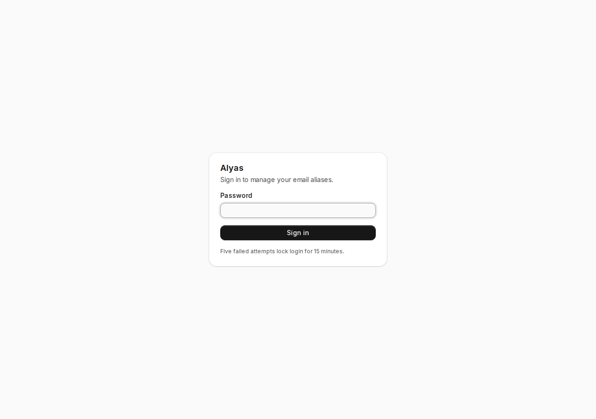
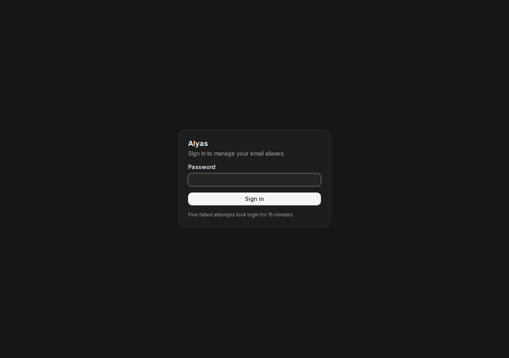

<p align="center">
  
</p>

<h1 align="center">Alyas</h1>

<p align="center">
  <strong>Create and retire Cloudflare email aliases from one private page.</strong><br>
  <em>Cloudflare remains the only source of truth.</em>
</p>

<p align="center">
  <a href="https://nextjs.org"></a>
  <a href="https://bun.sh"></a>
  <a href="https://tailwindcss.com"></a>
  <a href="LICENSE"></a>
</p>

Alyas reads Email Routing rules and verified destination addresses directly from Cloudflare. It creates literal forwarding rules, toggles them, and deletes them. There is no local alias database to migrate, back up, or reconcile.

Keep the deployed application private. The included password gate is defense in depth, not a replacement for a VPN, private network, or access proxy.

## Screenshots

<p align="center">
  
  
</p>

## Features

- Generates word-pair aliases or eight-character hexadecimal aliases
- Accepts custom local-parts with strict validation
- Routes only to Cloudflare-verified destinations
- Enables, disables, copies, and deletes alias rules
- Keeps catch-all rules inaccessible to application actions
- Stores labels in Cloudflare's rule name field
- Protects mutations with a signed, httpOnly session cookie
- Locks password login for 15 minutes after five failures
- Supports keyboard navigation, screen readers, narrow screens, and light or dark themes

## Requirements

- Bun 1.3.14
- A domain with Cloudflare Email Routing enabled
- A Cloudflare API token with these permissions:
  - `Zone > Email Routing Rules > Edit`
  - `Zone > Zone > Read`
  - `Account > Email Routing Addresses > Read`
- A private network boundary such as WireGuard, Tailscale, Cloudflare Access, or an equivalent control

## Setup

Install dependencies and create local configuration:

```bash
bun install
cp .env.example .env.local
bun run hash-password
openssl rand -hex 32
```

Add the password hash and random session secret to `.env.local`, then fill in the Cloudflare values. Start the development server:

```bash
bun run dev
```

Development uses Next.js's default port. Production binds to `127.0.0.1:3040`.

## Environment

| Variable | Purpose |
| --- | --- |
| `CLOUDFLARE_API_TOKEN` | Scoped token used for Email Routing reads and rule changes |
| `CLOUDFLARE_ACCOUNT_ID` | Cloudflare account containing verified destinations |
| `CLOUDFLARE_ZONE_ID` | Zone whose Email Routing rules Alyas manages |
| `ALYAS_DOMAIN` | Domain appended to local-parts |
| `ALYAS_PASSWORD_HASH` | Scrypt result in `salt:hash` format |
| `ALYAS_SESSION_SECRET` | Random secret used to sign 30-day session cookies |

Never commit `.env.local` or production environment files. Revoke a token immediately if it appears in chat, shell history, logs, screenshots, or Git history.

## Validation

```bash
bun run lint
bun run check
```

`check` runs TypeScript, unit tests, and a production build. After building, verify the authentication boundary:

```bash
bun run start
curl -si http://127.0.0.1:3040/
```

The unauthenticated request should return `307` with `location: /login`.

## Deployment

Run Alyas behind a private reverse proxy. A minimal systemd unit can use a dedicated service account and a root-owned environment file:

```ini
[Unit]
Description=Alyas Cloudflare Email Alias Manager
After=network-online.target
Wants=network-online.target

[Service]
Type=simple
User=alyas
WorkingDirectory=/opt/alyas
EnvironmentFile=/etc/alyas.env
Environment=NODE_ENV=production
ExecStart=/usr/local/bin/bun run start
Restart=always
RestartSec=5

[Install]
WantedBy=multi-user.target
```

Adjust the user, working directory, and Bun path for your host. Keep `/etc/alyas.env` readable only by root.

A Caddy virtual host can restrict access to a private subnet before proxying to Alyas:

```caddyfile
aliases.example.com {
	@private remote_ip 10.0.0.0/24
	handle @private {
		reverse_proxy 127.0.0.1:3040
	}
	handle {
		abort
	}
}
```

Use your own hostname, TLS configuration, and private network range. Verify the site from both allowed and denied networks.

## End-to-end routing check

With a write-scoped token installed:

1. Create a temporary alias through Alyas.
2. Confirm the literal forwarding rule in Cloudflare.
3. Disable it and confirm the Cloudflare rule changes.
4. Enable it, send a real message, and confirm delivery at the selected destination.
5. Delete it and confirm the Cloudflare rule count returns to its original value.

Only message delivery proves routing works. A successful API response proves only that Cloudflare accepted the rule.

## Project structure

```text
app/                       App Router pages and authenticated Server Actions
components/                Alias flows, theme controls, and local coss primitives
lib/                       Cloudflare client, auth, generators, and unit tests
scripts/hash-password.ts   Scrypt password hash helper
docs/                      README screenshots
proxy.ts                   Next.js request-time authentication gate
```

Next.js 16 renamed the deprecated `middleware.ts` convention to `proxy.ts`. Alyas uses the current name and repeats authorization inside every Server Action.

## License

MIT
